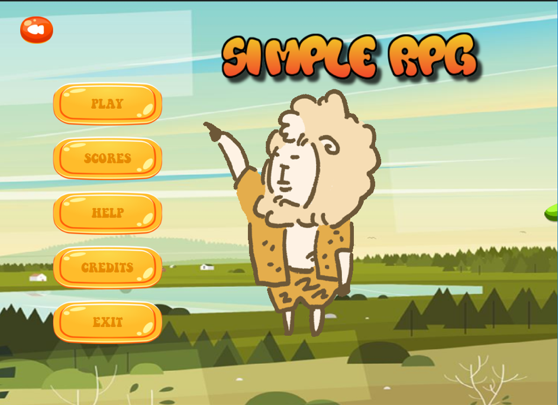
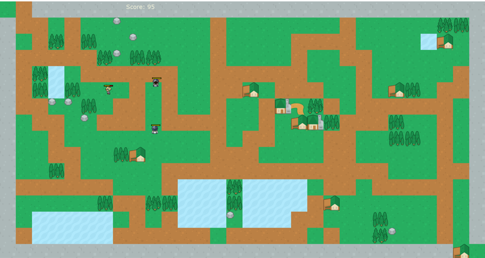

# Java Project: Simple RPG

### Members (5)

### Requirements:
   - JDK >= 8 
### Milestones

   
Click to expand!
  
   - 27/4/2020:       <pre></code>Start with awt</code></pre>
   - Until 12/5/2020: <pre></code>NetK Jobfair --> Pause</code></pre>
   - Until 22/5/2020: <pre></code>Sun* Jobfair --> Pause</code></pre>
   - 23/5/2020:       <pre></code>Restart with javafx, work individualy on gameMenu for 1 weeks</code></pre>
   - 29/5/2020:       <pre></code>Team is devided in 2 groups: one finishes the menu, other works on game details</code></pre>
   - 4/6/2020:        <pre></code>Work on two diff branchs: menuView & gameView</code></pre>

### Demo

